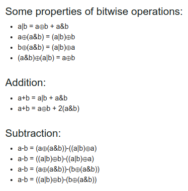

* Mid in `odd/even` array

    ```cpp
    /* n = 6(even)
    [           mid = (L+R)/2                                ]
    [L          L + (R-L)/2      R - (R-L)/2               R ] */
    [0  1           2         |      3               4     5 ]
    [0 ...        (n-1)/2     |  n/2 = (n+1)/2      ...   n-1]


    /* n = 5(odd)
    [                       mid = (L+R)/2                          ]
    [L              L + (R-L)/2 = R - (R-L)/2                    R ] */
    [0      1                   2                   3            4 ]
    [0     ...          (n-1)/2 = n/2             (n+1)/2       n-1]

    ```
---

* **XOR** of **1** to **n** Numbers

    ```
    focus on last 2 bits, number of 1's and 0's are getting equal
    after 4 iterations. that's why xor 0, also when xor is 0
    the number is always odd, next number is even.

    1         1          [0001]                     1
    2        10          [0011]                 n + 1
    3        11          [0000]  <----- We get a 0
    4       100          [0100]  <----- Equals to n
    5       101          [0001]                     1
    6       110          [0111]                 n + 1
    7       111          [0000]  <----- We get 0
    8      1000          [1000]  <----- Equals to n
    ```
---

* Properties of bitwise operations (proof - Venn diagram)

    [](https://codeforces.com/blog/entry/94470)

---
